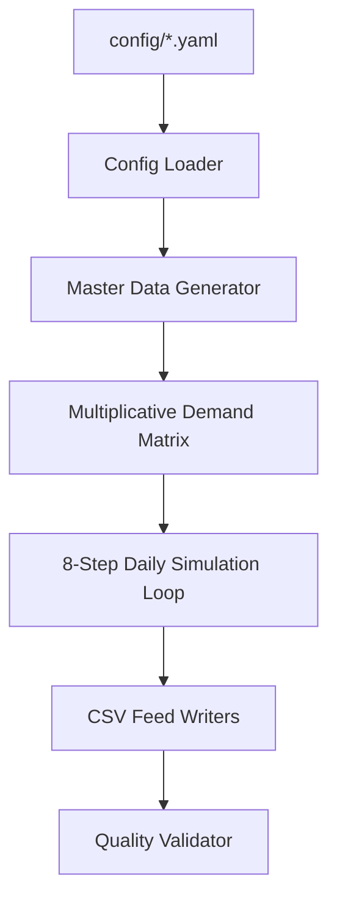

# Retail Data Factory — Detailed Workflow Logic

This document describes the internal engineering and simulation pipeline of the Data Factory. While the current baseline is configured for the **Potato Chips Scenario**, the engine is built to be a generic, cross-vertical generator.

---

## 🏗 High-Level Architecture

The system operates as a logical pipeline, moving from a static configuration to a dynamic simulation and finally to a standardized output suite.

---

## 🧠 1. Input: The Scenario Config
The world is defined entirely in a YAML file (e.g., `config/chips_baseline.yaml`). 
- **Network**: Defines Sites (Stores, DCs), Suppliers, and Items (SKUs).
- **Behavior**: Sets replenishment policies (e.g., `demand_driven`) and lead times.
- **Events**: Schedules Promotions, Supply Shortages, and Demand Overrides.

---

## 📈 2. Pre-calculation: Demand Matrix
Before the simulation starts, the engine calculates the "Latent Demand" (what customers *want* to buy). This allows the simulation to remain deterministic and fast.

**The Multiplicative Formula**:
`Demand = Base * StorePopularity * Seasonality * Promotion * (1 + Noise)`
- **StorePopularity**: A site-specific multiplier (e.g., 1.2 for flagships).
- **Seasonality**: Day-of-week multipliers (e.g., +15% on weekends).
- **Noise**: Seeded Gaussian variation to prevent "too perfect" data.

---

## 🔄 3. Operational Logic: The 8-Step Daily Loop
Standard retail operations occur in a strict sequential order every simulated day to ensure data integrity:

### Step 1: Supplier Receipts at DC
Supplier shipments triggered by previous POs are added to the DC's On-Hand inventory. 
*Reality Layer*: Check for receipt randomness (lateness or partials).

### Step 2: Store Receipts from DC
Shipments that left the DC on previous days (based on `dc_to_store_lead_time_days`) arrive at the stores.

### Step 3: Create Customer Orders
The pre-calculated demand for the day is captured. This is the **Requested Quantity**.

### Step 4: Compute Store Replenishment Need
Determines how many units the store *needs* to order from the DC using the selected policy:
- `demand_driven`: Simple 1-for-1 replacement of yesterday's sales.
- `coverage_based`: Future-looking moving average × safety stock days.

### Step 5: Allocate DC → Store Shipments
The DC fulfills store needs.
*Constraint Check*: If the DC is low (or there is a `shortage_event`), the system uses **Proportional Allocation**—available stock is distributed fairly based on each store's fractional need.

### Step 6: Fulfill Deliveries at Stores
The store attempts to sell to customers.
*Constraint Check*: `Satisfied = min(Requested, OnHand)`. If On-Hand is insufficient, the remainder is logged as **Lost Sales**.

### Step 7: Write Sales History
The confirmed `Satisfied` quantity is recorded as the daily sales transaction.

### Step 8: Administrative Closing
- **Purchase Orders**: On review days (e.g., Mondays), the DC calculates its own replenishment and sends POs to suppliers.
- **Inventory Snapshot**: A 100% accurate snapshot of end-of-day On-Hand is recorded for every node.

---

## ✅ 4. Output & Quality Control
The engine exports **14 CSV Feeds** (13 Phase 1 feeds + 1 Store Logistics feed) and a `run_manifest.json`.

**The Validator** then runs a 5-point audit:
1. **Schema**: Required columns and non-null constraints.
2. **Referential Integrity**: SiteIDs and ItemIDs must match across all transactions.
3. **Non-negativity**: On-Hand inventory must *never* be negative.
4. **Consistency**: Sales must logically match Deliveries.
5. **Reconciliation**: `EndOH = StartOH + Receipts - Sales (±0 discrepancy)`.
